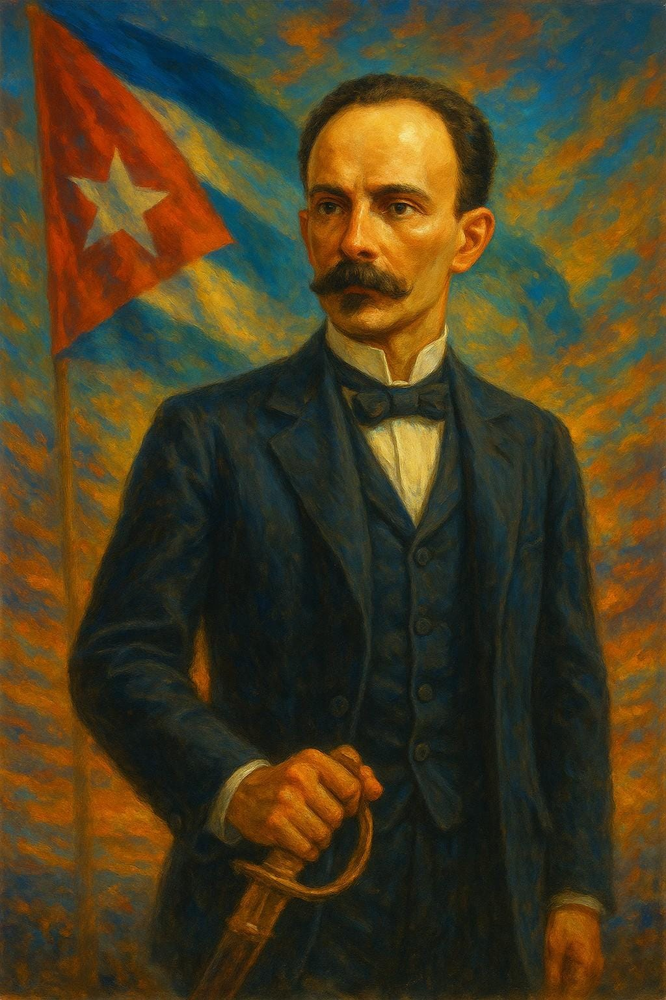

# Backlog SEO - Patriotas del Caribe (PDC)
## Estrategia de Posicionamiento para Cuba, República Dominicana, Migración y Patriotismo Caribeño

---

## 🎯 Objetivo General
Posicionar PDC en búsquedas sobre Cuba, República Dominicana, migración, patriotismo, Caribe y cubanos en RD, organizando el trabajo en fases ejecutables "una por una".

---

## 📊 Fase 0 — Fundaciones (Día 1–3)

### T1. Conectar medición
**Prioridad:** CRÍTICA | **Tiempo estimado:** 2 horas

**Tareas específicas:**
- [ ] Crear propiedad GA4 para patriotasdelcaribe.com
- [ ] Configurar Google Tag Manager (GTM) con contenedor
- [ ] Verificar dominio en Google Search Console (GSC)
- [ ] Publicar contenedores GTM en todas las páginas .php
- [ ] Implementar eventos GA4:
  - [ ] page_view (automático)
  - [ ] click (CTA WhatsApp/Registro)
  - [ ] submit (formulario de registro)
- [ ] Verificar funcionamiento de eventos en tiempo real

**Código a implementar:**
```php
// En cada página PHP, después de <head>
<script>
  gtag('event', 'page_view', {
    page_title: '<?php echo $page_title; ?>',
    page_location: window.location.href
  });
</script>
```

---

### T2. Sitemap + robots
**Prioridad:** CRÍTICA | **Tiempo estimado:** 1 hora

**Tareas específicas:**
- [ ] Generar sitemap.xml actualizado con todas las páginas:
  - [ ] index.php
  - [ ] faq.php
  - [ ] historia.php
  - [ ] mision_patriotica.php
  - [ ] sobre_cuba.php
  - [ ] valores.php
  - [ ] plan_trabajo.php
  - [ ] privacidad.php
  - [ ] terminos.php
- [ ] Crear robots.txt permitiendo todo salvo /vendor/ y parámetros raros
- [ ] Enviar sitemap en Google Search Console
- [ ] Verificar indexación en GSC

**Archivo robots.txt:**
```
User-agent: *
Allow: /
Disallow: /vendor/
Disallow: /private/
Disallow: /*?*
Sitemap: https://www.patriotasdelcaribe.com/sitemap.xml
```

---

### T3. Canonical y hreflang
**Prioridad:** ALTA | **Tiempo estimado:** 1 hora

**Tareas específicas:**
- [ ] Añadir `<link rel="canonical">` en cada página
- [ ] Preparar hreflang para futuro EN (de momento solo es-DO)
- [ ] Verificar que no hay contenido duplicado

**Código a implementar:**
```html
<link rel="canonical" href="https://www.patriotasdelcaribe.com/esta-pagina" />
<link rel="alternate" hreflang="es-DO" href="https://www.patriotasdelcaribe.com/esta-pagina" />
```

---

## 🔧 Fase 1 — Técnica On-Page (Día 3–7)

### T4. Plantilla <head> única y reutilizable
**Prioridad:** CRÍTICA | **Tiempo estimado:** 3 horas

**Tareas específicas:**
- [ ] Crear archivo `includes/head.php` con plantilla base
- [ ] Incluir meta tags estándar en todas las páginas
- [ ] Ajustar título y descripción por página
- [ ] Implementar Open Graph y Twitter Cards
- [ ] Optimizar carga de fuentes

**Plantilla base:**
```html
<title><?php echo $page_title; ?> | Patriotas del Caribe</title>
<meta name="description" content="<?php echo $page_description; ?>" />
<link rel="canonical" href="https://www.patriotasdelcaribe.com<?php echo $_SERVER['REQUEST_URI']; ?>" />
<meta name="viewport" content="width=device-width,initial-scale=1" />
<meta property="og:type" content="website" />
<meta property="og:title" content="<?php echo $page_title; ?>" />
<meta property="og:description" content="<?php echo $page_description; ?>" />
<meta property="og:url" content="https://www.patriotasdelcaribe.com<?php echo $_SERVER['REQUEST_URI']; ?>" />
<meta property="og:image" content="https://www.patriotasdelcaribe.com/images/og-cover.jpg" />
<meta name="twitter:card" content="summary_large_image" />
<link rel="preload" as="font" href="/fonts/roboto.woff2" type="font/woff2" crossorigin>
```

---

### T5. Un (1) <h1> por página + jerarquía
**Prioridad:** ALTA | **Tiempo estimado:** 2 horas

**Tareas específicas:**
- [ ] **index.php** → H1: "Patriotas del Caribe: apoyo a cubanos en República Dominicana"
- [ ] **sobre_cuba.php** → H1: "Cuba y el Caribe: contexto para la comunidad cubana en RD"
- [ ] **mision_patriotica.php** → H1: "Misión patriótica caribeña: libertad, familia y comunidad"
- [ ] **valores.php** → H1: "Valores y principios de Patriotas del Caribe"
- [ ] **faq.php** → H1: "Preguntas frecuentes: cubanos en República Dominicana"
- [ ] **plan_trabajo.php** → H1: "Plan de trabajo: regularización y apoyo a migrantes cubanos"
- [ ] Asegurar jerarquía H2/H3 con keywords naturales
- [ ] Verificar que solo hay un H1 por página

---

### T6. Accesibilidad/semántica
**Prioridad:** ALTA | **Tiempo estimado:** 4 horas

**Tareas específicas:**
- [ ] Reemplazar divs por elementos semánticos:
  - [ ] `<main>` para contenido principal
  - [ ] `<article>` para artículos
  - [ ] `<section>` para secciones
  - [ ] `<aside>` para contenido lateral
  - [ ] `<nav>` para navegación
- [ ] Añadir alt descriptivo en todas las imágenes
- [ ] Incluir keywords relevantes en alt text: "cubanos", "República Dominicana"
- [ ] Verificar estructura semántica con validador W3C

**Ejemplos de alt text:**
```html


```

---

### T7. Performance Core Web Vitals
**Prioridad:** ALTA | **Tiempo estimado:** 6 horas

**Tareas específicas:**
- [ ] Convertir imágenes pesadas a WebP
- [ ] Añadir `loading="lazy"` a imágenes no críticas
- [ ] Minificar y inline critical CSS del above the fold
- [ ] Quitar CSS/JS no usado
- [ ] Combinar archivos CSS/JS donde sea sensato
- [ ] Implementar `font-display: swap`
- [ ] Configurar compresión gzip/brotli
- [ ] Optimizar cache headers

**Objetivos Core Web Vitals:**
- LCP < 2.5s
- CLS < 0.1
- INP < 200ms

---

## 📋 Fase 2 — Datos estructurados (Día 5–10)

### T8. Organization/Nonprofit + WebSite + SiteNavigation
**Prioridad:** ALTA | **Tiempo estimado:** 3 horas

**Tareas específicas:**
- [ ] Implementar schema Organization/Nonprofit en todas las páginas
- [ ] Añadir schema WebSite con SearchAction
- [ ] Implementar schema SiteNavigationElement
- [ ] Validar schemas en Rich Results Test
- [ ] Verificar que aparecen en Google

**Código JSON-LD:**
```json
{
  "@context":"https://schema.org",
  "@type":"NonprofitOrganization",
  "name":"Fundación Patriotas del Caribe",
  "url":"https://www.patriotasdelcaribe.com",
  "logo":"https://www.patriotasdelcaribe.com/images/logo.png",
  "areaServed":["DO","CU","Caribe"],
  "sameAs":[
    "https://www.facebook.com/groups/1672337816821354",
    "https://www.instagram.com/patriotasdelcaribe"
  ]
}
```

---

### T9. FAQPage en faq.php
**Prioridad:** MEDIA | **Tiempo estimado:** 2 horas

**Tareas específicas:**
- [ ] Seleccionar 5-10 preguntas sobre migración cubanos en RD
- [ ] Marcar con schema FAQPage
- [ ] Incluir preguntas sobre "cómo registrarse"
- [ ] Validar en Rich Results Test
- [ ] Verificar aparición en resultados enriquecidos

**Preguntas sugeridas:**
1. ¿Cómo puedo regularizar mi situación migratoria en República Dominicana?
2. ¿Qué documentos necesito para el registro en Patriotas del Caribe?
3. ¿Cuáles son los derechos de los migrantes cubanos en RD?
4. ¿Dónde puedo encontrar apoyo legal para migrantes?
5. ¿Cómo funciona el proceso de confirmación por email?

---

### T10. Article en páginas de contenido largo
**Prioridad:** MEDIA | **Tiempo estimado:** 3 horas

**Tareas específicas:**
- [ ] **historia.php** con schema Article
- [ ] **mision_patriotica.php** con schema Article
- [ ] **sobre_cuba.php** con schema Article
- [ ] Incluir autor, fecha, imagen, sección "Caribe/Migración"
- [ ] Validar schemas en Rich Results Test

---

## 📚 Fase 3 — Arquitectura de Contenidos (Semana 2–4)

### T11. Crear Hub Temático (pilar + clusters)
**Prioridad:** CRÍTICA | **Tiempo estimado:** 20 horas

**Tareas específicas:**

#### Pilar 1: "Cubanos en República Dominicana: Guía completa 2025" (2.000–3.000 palabras)
- [ ] Crear página principal del hub
- [ ] Estructurar contenido en secciones claras
- [ ] Incluir tabla de contenidos
- [ ] Añadir enlaces a todos los clusters

#### Clusters (800–1200 palabras cada uno):
- [ ] **Requisitos y vías de regularización en RD**
- [ ] **Trabajo formal e informal: derechos y consejos**
- [ ] **Salud y educación para migrantes cubanos**
- [ ] **Vivienda y costo de vida en Santo Domingo vs. Santiago**
- [ ] **Comunidades y redes de apoyo (ONGs, iglesias, grupos)**
- [ ] **Trámites frecuentes (apostillas, antecedentes, prórrogas)**
- [ ] **Errores comunes y cómo evitarlos**
- [ ] **Directorio útil (instituciones, contactos, horarios)**

#### Pilar 2: "Patriotismo caribeño: historia y valores compartidos"
- [ ] Crear contenido sobre historia compartida
- [ ] Incluir biografías de héroes caribeños
- [ ] Desarrollar clusters culturales e históricos

#### Pilar 3: "Cuba y República Dominicana: puentes migratorios y económicos"
- [ ] Análisis de relaciones bilaterales
- [ ] Datos migratorios históricos
- [ ] Perspectivas económicas

---

### T12. Brief SEO por pieza
**Prioridad:** ALTA | **Tiempo estimado:** 8 horas

**Tareas específicas:**
- [ ] Definir keyword principal para cada artículo
- [ ] Seleccionar 2-3 keywords secundarias
- [ ] Estructurar H2/H3 con keywords
- [ ] Incluir FAQ en cada artículo
- [ ] Añadir CTA (Registro/WhatsApp) en cada pieza

**Template de brief:**
```
Artículo: [Título]
Keyword principal: [keyword]
Keywords secundarias: [keyword1, keyword2, keyword3]
H2s sugeridos: [lista]
FAQ a incluir: [preguntas]
CTA: [llamada a la acción]
```

---

### T13. Plantilla de meta tags por artículo
**Prioridad:** MEDIA | **Tiempo estimado:** 2 horas

**Tareas específicas:**
- [ ] Crear plantilla estándar para meta tags
- [ ] Implementar en todos los artículos nuevos
- [ ] Asegurar descripciones de 150-160 caracteres
- [ ] Incluir keyword y beneficio en descripción

**Plantilla:**
```html
<title>{H1} | Patriotas del Caribe</title>
<meta name="description" content="{Resumen 150–160c con keyword y beneficio}"/>
```

---

### T14. Slugs SEO y enlaces internos
**Prioridad:** ALTA | **Tiempo estimado:** 4 horas

**Tareas específicas:**
- [ ] Crear slugs cortos y claros:
  - [ ] `/cubanos-en-rd-guia`
  - [ ] `/regularizacion-rd`
  - [ ] `/trabajo-derechos-rd`
  - [ ] `/salud-educacion-migrantes`
  - [ ] `/vivienda-costo-vida-rd`
- [ ] Implementar enlaces internos desde pilar a clusters
- [ ] Añadir enlaces entre clusters relacionados
- [ ] Usar anchor text con intención: "regularización en RD", "derechos laborales en RD"

---

### T15. CTA consistentes
**Prioridad:** MEDIA | **Tiempo estimado:** 2 horas

**Tareas específicas:**
- [ ] Crear plantilla de CTA para artículos
- [ ] Implementar al final de cada artículo
- [ ] Configurar evento GA4 para CTA
- [ ] Texto: "Regístrate para recibir orientación"

**CTA template:**
```html
<div class="cta-article">
  <h3>¿Necesitas orientación personalizada?</h3>
  <p>Regístrate en Patriotas del Caribe y recibe apoyo directo</p>
  <a href="/#formulario" class="btn-primary">Registrarse Ahora</a>
</div>
```

---

## 🏛️ Fase 4 — E-E-A-T y confianza (Semana 3–4)

### T16. Página "Quiénes somos/Equipo/Asesores"
**Prioridad:** ALTA | **Tiempo estimado:** 6 horas

**Tareas específicas:**
- [ ] Crear página `quienes-somos.php`
- [ ] Incluir biografías con expertise:
  - [ ] Migración
  - [ ] Legal
  - [ ] Social
- [ ] Añadir fotos reales optimizadas
- [ ] Incluir LinkedIn opcional
- [ ] Implementar schema Person para cada miembro

---

### T17. Transparencia ONG
**Prioridad:** ALTA | **Tiempo estimado:** 4 horas

**Tareas específicas:**
- [ ] Crear página `transparencia.php`
- [ ] Publicar estatutos
- [ ] Mostrar objetivos claros
- [ ] Hacer visibles políticas de privacidad y términos
- [ ] Crear página "Impacto" con cifras:
  - [ ] Registros procesados
  - [ ] Atenciones realizadas
  - [ ] Casos resueltos

---

### T18. Testimonios y casos
**Prioridad:** MEDIA | **Tiempo estimado:** 5 horas

**Tareas específicas:**
- [ ] Recopilar 6-10 testimonios verificados
- [ ] Incluir nombre y ciudad (con permiso)
- [ ] Crear página `testimonios.php`
- [ ] Implementar schema Review solo para testimonios reales
- [ ] Evitar calificaciones inventadas

---

## 🔗 Fase 5 — Autoridad (Backlinks + PR) (Semana 4–8)

### T19. Directorios y listados
**Prioridad:** MEDIA | **Tiempo estimado:** 8 horas

**Tareas específicas:**
- [ ] Registrar en directorios de ONGs RD
- [ ] Contactar universidades locales
- [ ] Acercarse a parroquias/diócesis con acción social
- [ ] Registrarse en consulados
- [ ] Contactar ayuntamientos (agenda social)
- [ ] Incluir en directorios de migración

**Lista de directorios:**
- [ ] Directorio ONGs República Dominicana
- [ ] Red de ONGs de Santo Domingo
- [ ] Directorio de organizaciones de migración
- [ ] Listados de universidades con programas sociales

---

### T20. Alianzas y menciones
**Prioridad:** MEDIA | **Tiempo estimado:** 12 horas

**Tareas específicas:**
- [ ] Contactar medios de RD y Cuba (digitales locales, radios comunitarias)
- [ ] Buscar oportunidades de guest posts en blogs de emigración
- [ ] Colaborar con comunidad caribeña
- [ ] Crear notas de prensa sobre actividades
- [ ] Participar en eventos de migración

---

### T21. Señales sociales
**Prioridad:** MEDIA | **Tiempo estimado:** 6 horas

**Tareas específicas:**
- [ ] Publicar cada nuevo artículo con resumen + enlace en Facebook/Instagram
- [ ] Crear Reels informativos (30–45s) con llamada al artículo
- [ ] Mantener consistencia en publicación
- [ ] Interactuar con comentarios y mensajes

---

## ⚡ Fase 6 — Core Web Vitals y UX continuo (Semana 2–8)

### T22. Medir y corregir
**Prioridad:** ALTA | **Tiempo estimado:** 8 horas

**Tareas específicas:**
- [ ] Medir PageSpeed/CrUX mensualmente
- [ ] Implementar lazy-load en imágenes
- [ ] Configurar compresión gzip/br
- [ ] Optimizar cache headers
- [ ] Implementar font-display: swap
- [ ] Monitorear Core Web Vitals en Search Console

**Objetivos:**
- LCP < 2.5s
- CLS < 0.1
- INP < 200ms

---

### T23. Navegación y búsqueda
**Prioridad:** MEDIA | **Tiempo estimado:** 6 horas

**Tareas específicas:**
- [ ] Implementar barra de búsqueda interna
- [ ] Activar SearchAction schema
- [ ] Crear migas de pan (BreadcrumbList) en contenidos largos
- [ ] Mejorar navegación entre artículos relacionados

---

## 📅 Fase 7 — Mantenimiento y escala (Mes 2–6)

### T24. Calendario editorial (2 posts/semana, 6 meses)
**Prioridad:** ALTA | **Tiempo estimado:** 40 horas

**Tareas específicas:**
- [ ] Crear calendario editorial para 6 meses
- [ ] Alternar entre "Migración práctica" y "Cultura/Historia/Valores"
- [ ] Programar: 1 mega-guía + 3–5 artículos de apoyo + 1 FAQ ampliada por mes
- [ ] Crear plantillas para cada tipo de contenido
- [ ] Establecer proceso de revisión y publicación

**Distribución mensual:**
- Semana 1: Artículo de migración práctica
- Semana 2: Artículo cultural/histórico
- Semana 3: Artículo de migración práctica
- Semana 4: FAQ ampliada o mega-guía

---

### T25. Actualizaciones
**Prioridad:** MEDIA | **Tiempo estimado:** 4 horas/mes

**Tareas específicas:**
- [ ] Revisar/actualizar guías cada 90 días
- [ ] Marcar "Actualizado el…" en contenido modificado
- [ ] Implementar redirecciones 301 si cambian slugs
- [ ] Mantener canónicas actualizadas
- [ ] Revisar enlaces rotos mensualmente

---

### T26. Search Console → acciones
**Prioridad:** ALTA | **Tiempo estimado:** 2 horas/semana

**Tareas específicas:**
- [ ] Corregir cobertura (404, soft 404, duplicadas)
- [ ] Mejorar click-through con titles/metas A/B
- [ ] Analizar queries que no aparecen
- [ ] Optimizar basado en datos de rendimiento
- [ ] Monitorear indexación de nuevas páginas

---

## 🗓️ Roadmap Sugerido (Resumen Operativo)

### Semana 1: Fundaciones y Técnica On-Page
- [ ] T1–T7: Medición, sitemap, canonical, head template, H1, semántica, performance

### Semana 2: Datos Estructurados + Contenido
- [ ] T8–T10: Schemas, FAQ, Article
- [ ] Publicar Pilar 1 (borrador)

### Semana 3: Arquitectura de Contenidos + Confianza
- [ ] T11–T15: Hub temático, briefs SEO, slugs, CTAs
- [ ] T16–T17: Equipo/Transparencia

### Semana 4: Testimonios + Optimizaciones
- [ ] T18: Testimonios
- [ ] T21: Señales sociales
- [ ] T22: Primera optimización CWV

### Mes 2–3: Escala y Autoridad
- [ ] T24: Calendario editorial activo
- [ ] T19–T21: Enlaces y PR
- [ ] T23: Mejoras UX

### Mes 4–6: Consolidación
- [ ] T25–T26: Actualizaciones y optimizaciones continuas

---

## 📝 Mini-paquetes "Copy-Paste" por Página

### Index.php
```html
<title>Patriotas del Caribe: Apoyo a Cubanos en República Dominicana | Migración y Derechos</title>
<meta name="description" content="Orientación en migración, derechos y comunidad para cubanos en RD. Regístrate gratis y recibe apoyo confiable de Patriotas del Caribe." />
<h1>Patriotas del Caribe: apoyo a cubanos en República Dominicana</h1>
```

### sobre_cuba.php
```html
<title>Cuba y el Caribe: Contexto para la Comunidad Cubana en RD | Patriotas del Caribe</title>
<meta name="description" content="Entiende el contexto histórico y cultural que une a Cuba y República Dominicana. Información para la comunidad cubana migrante." />
<h1>Cuba y el Caribe: contexto para la comunidad cubana en RD</h1>
```

### mision_patriotica.php
```html
<title>Misión Patriótica Caribeña: Libertad, Familia y Comunidad | Patriotas del Caribe</title>
<meta name="description" content="Conoce nuestra misión de defender la libertad, apoyar a las familias migrantes y construir comunidad caribeña solidaria." />
<h1>Misión patriótica caribeña: libertad, familia y comunidad</h1>
```

### valores.php
```html
<title>Valores y Principios de Patriotas del Caribe | Fundación Migración</title>
<meta name="description" content="Los valores que guían nuestro trabajo: patriotismo, respeto, solidaridad y compromiso con la comunidad migrante cubana." />
<h1>Valores y principios de Patriotas del Caribe</h1>
```

### faq.php
```html
<title>Preguntas Frecuentes: Cubanos en República Dominicana | Patriotas del Caribe</title>
<meta name="description" content="Respuestas a las preguntas más comunes sobre migración, derechos y procesos para cubanos en República Dominicana." />
<h1>Preguntas frecuentes: cubanos en República Dominicana</h1>
```

### plan_trabajo.php
```html
<title>Plan de Trabajo: Regularización y Apoyo a Migrantes Cubanos | Patriotas del Caribe</title>
<meta name="description" content="Conoce nuestro plan integral para la regularización humanitaria y apoyo a migrantes cubanos en República Dominicana." />
<h1>Plan de trabajo: regularización y apoyo a migrantes cubanos</h1>
```

---

## 📊 Métricas de Éxito

### Objetivos 3-6 meses:
- [ ] **1,000-3,000 clics orgánicos/mes** (Google Search Console)
- [ ] **15-30 keywords top-10** en República Dominicana
- [ ] **CTR >4%** en páginas clave
- [ ] **Ratio de registro >3-5%** en posts prácticos
- [ ] **Tiempo medio >2:30** en pilares de contenido

### KPIs de Seguimiento:
- [ ] Posiciones promedio en keywords objetivo
- [ ] Tráfico orgánico mensual
- [ ] Conversiones (registros) desde contenido
- [ ] Engagement en redes sociales
- [ ] Core Web Vitals scores
- [ ] Número de backlinks de calidad

---

## 🚀 Próximos Pasos Inmediatos

1. **HOY:** Completar T1 (conectar medición)
2. **MAÑANA:** T2-T3 (sitemap, robots, canonical)
3. **DÍA 3:** T4-T5 (head template, H1)
4. **DÍA 4:** T6-T7 (semántica, performance)
5. **DÍA 5:** T8 (datos estructurados)

---

*Documento creado para el proyecto Patriotas del Caribe - Versión 1.0*
*Actualizado: Enero 2025*
