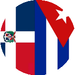

# Patriotas del Caribe - Sitio Web Oficial



## Descripción

Sitio web oficial de la **Fundación Patriotas del Caribe**, una organización sin fines de lucro que apoya a migrantes cubanos en República Dominicana. El sitio proporciona información sobre regularización migratoria, derechos humanos y servicios de orientación legal.

## Características

- 🌐 **Sitio web responsivo** con diseño moderno
- 📝 **Sistema de registro voluntario** para migrantes cubanos
- 📧 **Sistema de confirmación por email** usando PHPMailer
- 🗄️ **Base de datos MySQL** para almacenar registros
- 🔍 **SEO optimizado** con meta tags y datos estructurados
- 📱 **Integración con redes sociales** (Facebook, WhatsApp, Instagram)
- 🎨 **Diseño accesible** con fuentes Google Fonts

## Tecnologías Utilizadas

- **PHP 7.4+** - Backend
- **MySQL** - Base de datos
- **PHPMailer** - Envío de correos
- **HTML5/CSS3** - Frontend
- **JavaScript** - Interactividad
- **Composer** - Gestión de dependencias

## Estructura del Proyecto

```
├── index.php              # Página principal
├── procesar.php           # Procesamiento de formularios
├── confirmar.php          # Confirmación de registros
├── plan_trabajo.php       # Plan de trabajo institucional
├── historia.php           # Historia de la organización
├── valores.php            # Valores y principios
├── sobre_cuba.php         # Información sobre Cuba
├── mision_patriotica.php  # Misión patriótica
├── faq.php               # Preguntas frecuentes
├── privacidad.php        # Políticas de privacidad
├── terminos.php          # Términos y condiciones
├── images/               # Recursos gráficos
├── vendor/               # Dependencias de Composer
├── style-patriotas.css   # Estilos principales
└── composer.json         # Configuración de dependencias
```

## Instalación

### Requisitos

- PHP 7.4 o superior
- MySQL 5.7 o superior
- Servidor web (Apache/Nginx)
- Composer

### Pasos de Instalación

1. **Clonar el repositorio**
   ```bash
   git clone https://github.com/magutie/pdc.git
   cd pdc
   ```

2. **Instalar dependencias**
   ```bash
   composer install --no-dev --optimize-autoloader
   ```

3. **Configurar base de datos**
   - Crear base de datos MySQL
   - Importar estructura de tablas (ver sección Base de Datos)

4. **Configurar variables de entorno**
   ```bash
   cp .env.example .env
   # Editar .env con tus configuraciones
   ```

5. **Configurar servidor web**
   - Apuntar document root al directorio del proyecto
   - Configurar PHP para procesar archivos .php

## Base de Datos

### Estructura de Tablas

```sql
-- Tabla para registros pendientes de confirmación
CREATE TABLE pendientes_confirmacion (
    id INT AUTO_INCREMENT PRIMARY KEY,
    nombre VARCHAR(255) NOT NULL,
    correo VARCHAR(255) NOT NULL,
    edad INT NOT NULL,
    fecha_entrada DATE NOT NULL,
    via_entrada VARCHAR(255) NOT NULL,
    escolaridad VARCHAR(255) NOT NULL,
    profesion VARCHAR(255) NOT NULL,
    ocupacion VARCHAR(255) NOT NULL,
    direccion VARCHAR(255) NOT NULL,
    familiares TEXT,
    token VARCHAR(64) UNIQUE NOT NULL,
    fecha_registro TIMESTAMP DEFAULT CURRENT_TIMESTAMP
);

-- Tabla para registros confirmados
CREATE TABLE registros_confirmados (
    id INT AUTO_INCREMENT PRIMARY KEY,
    nombre VARCHAR(255) NOT NULL,
    correo VARCHAR(255) NOT NULL,
    edad INT NOT NULL,
    fecha_entrada DATE NOT NULL,
    via_entrada VARCHAR(255) NOT NULL,
    escolaridad VARCHAR(255) NOT NULL,
    profesion VARCHAR(255) NOT NULL,
    ocupacion VARCHAR(255) NOT NULL,
    direccion VARCHAR(255) NOT NULL,
    familiares TEXT,
    fecha_confirmacion TIMESTAMP DEFAULT CURRENT_TIMESTAMP
);
```

## Configuración

### Variables de Entorno

Crear archivo `.env` con las siguientes variables:

```env
# Base de datos
DB_HOST=localhost
DB_NAME=u276320034_PDC
DB_USER=u276320034_oropesa
DB_PASS=tu_password_aqui

# Email
MAIL_FROM=contacto@patriotasdelcaribe.com
MAIL_FROM_NAME=Patriotas del Caribe

# Aplicación
APP_URL=https://www.patriotasdelcaribe.com
APP_NAME=Patriotas del Caribe
```

## Uso

### Formulario de Registro

El sitio incluye un formulario de registro voluntario para migrantes cubanos que incluye:

- Información personal básica
- Fecha de entrada a República Dominicana
- Vía de entrada
- Nivel de escolaridad
- Profesión y ocupación actual
- Dirección de residencia
- Información sobre familiares

### Proceso de Confirmación

1. Usuario completa el formulario
2. Sistema genera token único
3. Se envía email de confirmación
4. Usuario hace clic en enlace de confirmación
5. Registro se mueve a tabla de confirmados

## Contribución

### Cómo Contribuir

1. Fork el proyecto
2. Crea una rama para tu feature (`git checkout -b feature/AmazingFeature`)
3. Commit tus cambios (`git commit -m 'Add some AmazingFeature'`)
4. Push a la rama (`git push origin feature/AmazingFeature`)
5. Abre un Pull Request

### Estándares de Código

- Seguir PSR-12 para PHP
- Comentar código complejo
- Usar nombres descriptivos para variables y funciones
- Mantener consistencia en el estilo

## Seguridad

- **Nunca** commitees credenciales de base de datos
- Usar variables de entorno para configuraciones sensibles
- Validar y sanitizar todas las entradas del usuario
- Usar prepared statements para consultas SQL
- Implementar rate limiting para formularios

## Licencia

Este proyecto está bajo la Licencia MIT. Ver el archivo [LICENSE](LICENSE) para más detalles.

## Contacto

**Fundación Patriotas del Caribe**

- Email: contacto@patriotasdelcaribe.com
- Facebook: [Patriotas del Caribe](https://www.facebook.com/groups/1672337816821354)
- Instagram: [@patriotasdelcaribe](https://www.instagram.com/patriotasdelcaribe)
- WhatsApp: [Grupo de WhatsApp](https://chat.whatsapp.com/DimB9T4dukkCvSVBVq1iuV)

## Agradecimientos

- A todos los migrantes cubanos que confían en nuestra organización
- A la comunidad dominicana por su apoyo y solidaridad
- A los desarrolladores que contribuyen a este proyecto

---

*"Después de Dios, la Patria y su Libertad"* - Patriotas del Caribe
